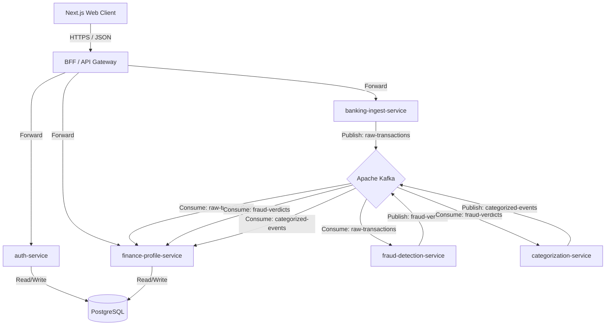

# 🏛️ Architecture & System Design Specification

This document details the architectural design, event structures, database constraints, and system flows of the **FinTrack & FraudShield Ecosystem**.

---

## 1. System Topology & Message Flow

The system is designed under a decoupled microservices approach connected via **Apache Kafka** for asynchronous processing and **PostgreSQL** for strict financial transactional consistency.



### Flow of a Banking Transaction:
1.  **Ingestion:** The [banking-ingest-service](file:///C:/Users/Victor/IdeaProjects/FinTrack/banking-ingest-service) receives a transaction payload (PSD2 Webhook) or parses an uploaded CSV file.
2.  **Raw Event:** Ingest validates the schema and publishes the transaction to the `raw-transactions` Kafka topic.
3.  **Audit Setup:** The [finance-profile-service](file:///C:/Users/Victor/IdeaProjects/FinTrack/finance-profile-service) consumes `raw-transactions` immediately, creating a ledger entry in PostgreSQL in a `PENDING` state with a category of `UNASSIGNED`.
4.  **Parallel Security Screening:** The [fraud-detection-service](file:///C:/Users/Victor/IdeaProjects/FinTrack/fraud-detection-service) consumes `raw-transactions` in parallel, applying rules to issue a verdict of `CLEAN` or `SUSPICIOUS` within 50ms (RNF-2), published to the `fraud-verdicts` topic.
5.  **Categorization:** Once a transaction is evaluated, the [categorization-service](file:///C:/Users/Victor/IdeaProjects/FinTrack/categorization-service) processes the merchant description, assigning an expense category (e.g., Vivienda, Alimentación) and publishing to the `categorized-events` topic.
6.  **Ledger Consolidating:** The `finance-profile-service` listens to `fraud-verdicts` and `categorized-events`:
    *   If `CLEAN`: Consolidates the transaction into the user's active balance and applies the category expense limits.
    *   If `SUSPICIOUS`: Quarantines the ledger entry, alerts the user, and skips updating financial statistics or budgets.

---

## 2. Event Contracts (Kafka Topics)

To maintain schema security (RNF-12), all Kafka messages must follow these JSON schemas.

### 2.1 Topic: `raw-transactions`
Published by: `banking-ingest-service` | Consumed by: `fraud-detection-service`, `finance-profile-service`
```json
{
  "$schema": "http://json-schema.org/draft-07/schema#",
  "title": "RawTransactionEvent",
  "type": "OBJECT",
  "required": ["transactionId", "userId", "accountNumber", "amount", "currency", "merchant", "timestamp"],
  "properties": {
    "transactionId": { "type": "STRING", "format": "uuid" },
    "userId": { "type": "STRING", "format": "uuid" },
    "accountNumber": { "type": "STRING" },
    "amount": { "type": "NUMBER" },
    "currency": { "type": "STRING", "pattern": "^[A-Z]{3}$" },
    "merchant": { "type": "STRING" },
    "timestamp": { "type": "STRING", "format": "date-time" }
  }
}
```

### 2.2 Topic: `fraud-verdicts`
Published by: `fraud-detection-service` | Consumed by: `categorization-service`, `finance-profile-service`
```json
{
  "$schema": "http://json-schema.org/draft-07/schema#",
  "title": "FraudVerdictEvent",
  "type": "OBJECT",
  "required": ["transactionId", "userId", "verdict", "reasons", "evaluatedAt"],
  "properties": {
    "transactionId": { "type": "STRING", "format": "uuid" },
    "userId": { "type": "STRING", "format": "uuid" },
    "verdict": { "type": "STRING", "enum": ["CLEAN", "SUSPICIOUS"] },
    "reasons": { 
      "type": "ARRAY", 
      "items": { "type": "STRING" } 
    },
    "evaluatedAt": { "type": "STRING", "format": "date-time" }
  }
}
```

### 2.3 Topic: `categorized-events`
Published by: `categorization-service` | Consumed by: `finance-profile-service`
```json
{
  "$schema": "http://json-schema.org/draft-07/schema#",
  "title": "TransactionCategorizedEvent",
  "type": "OBJECT",
  "required": ["transactionId", "category", "categorizedAt"],
  "properties": {
    "transactionId": { "type": "STRING", "format": "uuid" },
    "category": { "type": "STRING", "enum": ["ALIMENTACION", "OCIO", "SALUD_DEPORTE", "TRANSPORTE", "VIVIENDA", "OTROS"] },
    "categorizedAt": { "type": "STRING", "format": "date-time" }
  }
}
```

---

## 3. Resilience & Database Strategy

### 3.1 Eventually Consistent & Highly Available (RNF-1)
If the analytic services (Fraud / Categorization) suffer high latencies or temporary downtime:
*   Transactions remain visible in the client UI as `PENDING`/`UNASSIGNED`.
*   Once Kafka consumers recover, the backlog is resolved and the database states are corrected without data loss.

### 3.2 Atomic Database Updates (RF-3.3)
To prevent race conditions when multiple transactions occur simultaneously:
*   Balance adjustments MUST be executed as atomic SQL transactions (e.g., using `@Modifying` queries in JPA):
    ```sql
    UPDATE accounts SET balance = balance + :amount WHERE id = :accountId
    ```
*   In-memory reading followed by a save (read-and-write) is strictly prohibited.

### 3.3 Dead Letter Queues & Retry Topics (RNF-10)
*   Consumers try to process events 3 times. If a persistent database timeout or infra error happens, the event is rerouted to a Dead Letter Queue (DLQ) topic `*-dlq` to prevent consumer blocking.

---

## 4. Observability & Context Propagation (RNF-11)
Distributed tracing is achieved using **OpenTelemetry**:
*   A `traceId` is generated at the entry point ([banking-ingest-service](file:///C:/Users/Victor/IdeaProjects/FinTrack/banking-ingest-service)).
*   The context metadata is injected into the headers of Kafka records.
*   Downstream consumers propagate this trace context, allowing unified traces across all log aggregates.
